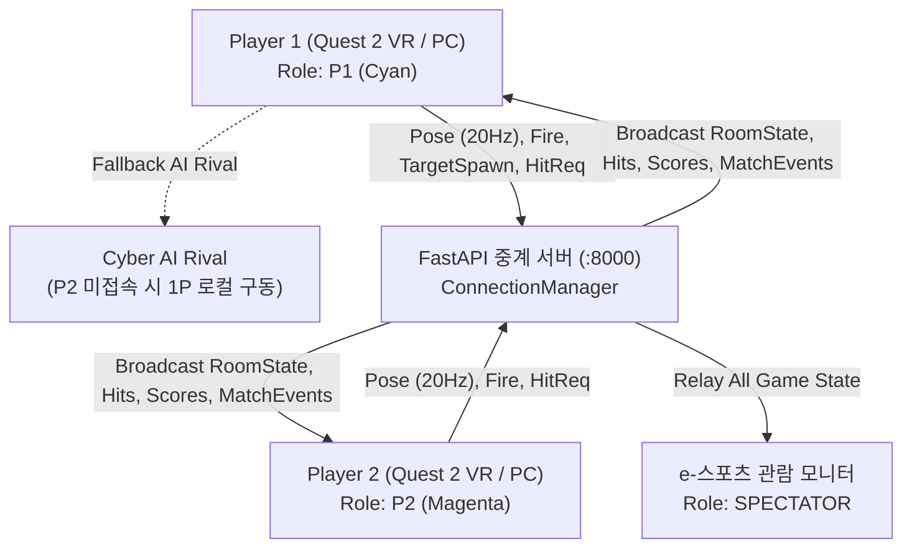

# Nunchuk VR Shooting Arena v1.3
## 프로젝트 요구사항 정의서 (PRD - Product Requirement Document)

- **개발 플랫폼**: Next.js 16 (App Router, TypeScript) + Three.js
- **VR 기기**: Meta Quest 2 / Quest 3 (WebXR)
- **입력 하드웨어**:
  1. Nintendo Wii Nunchuk + Raspberry Pi Pico 2 W (주 입력기)
  2. Meta Quest 2 Touch Controller (순정 6DoF 모션 컨트롤러 - 단독 구동 지원)
  3. 스마트폰/PC 가상 웹패드 (Virtual Pad)
  4. PC 키보드 & 마우스 (개발 및 폴백 모드)
- **문서 버전**: v1.3 (1:1 실시간 대결 모드, Cyber AI 라이벌, e-스포츠 옵저버 방송 중계 시스템)
- **최종 갱신일**: 2026-10-02

---

## 1. 프로젝트 개요

### 1.1 프로젝트 목적
닌텐도 눈차크(Wii Nunchuk)와 Raspberry Pi Pico 2 W를 무선 컨트롤러로 활용하여 Meta Quest 2 웹 브라우저에서 가상 표적을 조준하고 사격하는 3D WebXR 슈팅 게임을 제작한다.  
하드웨어가 없는 환경에서도 **Quest 2 순정 터치 컨트롤러(6DoF)** 및 **웹 가상 컨트롤러**를 지원하여, 사용자가 언제 어디서나 즉시 몰입형 VR 사격 게임을 체험할 수 있도록 한다.  
v1.3에서는 **1:1 실시간 대결(PvP 및 Cyber AI 라이벌)**, **실시간 점수 줄다리기(Tug-of-War) 스코어보드**, **제3자 e-스포츠 관람 모드(Observer/Spectator) 및 4단 방송 카메라 시스템**을 전면 구축하여 개인 아케이드 연습을 넘어 인터랙티브 멀티플레이어 e-스포츠 플랫폼으로 진화한다.

### 1.2 핵심 특징 (v1.3 신규 및 주요 고도화)
- **1:1 실시간 대결 모드 (Versus Mode)**:
  - 1P(Cyan)와 2P(Magenta) 플레이어가 동일한 3D 사격 공간에 동시 접속하여 60초간 동일 표적을 먼저 타격하는 선착순 점수 쟁탈전.
  - 2P가 미접속한 싱글 환경에서는 **Cyber AI Rival** 봇이 자동으로 참전하여 난이도별(Easy/Normal/Hard) 사람과 유사한 반응 속도와 사격 명중률로 긴장감 넘치는 1:1 라이벌전을 제공.
- **실시간 6DoF 자세 및 사격 동기화 (Multiplayer Pose Sync)**:
  - 플레이어의 헤드셋(HMD) 위치/회전 및 블래스터 총구 방향을 20Hz 주기로 FastAPI WebSocket 서버를 통해 실시간 브로드캐스트.
  - 상대 플레이어의 3D 사이버 아바타 헬멧과 레이저 블래스터 조준선, 총구 화염(Muzzle Flash)이 가상 공간에 실시간으로 시각화.
- **실시간 줄다리기(Tug-of-War) 스코어보드**:
  - 상단 HUD 중앙에 양 선수의 점수 비율을 실시간 네온 게이지 바로 시각화하여 현재 우세한 플레이어(P1 LEAD / P2 LEAD / TIED) 및 점수 격차를 다이내믹하게 디스플레이.
- **e-스포츠 관람 모드 (Observer / Spectator Broadcast Mode)**:
  - HMD 없이 대형 화면(스마트 TV, 프로젝터, PC 모니터)으로 경기를 관람할 수 있는 독립 관람자 롤(`SPECTATOR`) 지원.
  - URL 파라미터(`?role=spectator` 또는 `?mode=observer`)나 메인 메뉴의 `[📺 관람 모드]` 버튼으로 원클릭 진입.
  - **4대 전문 중계 카메라 시점 전환**:
    1. `[1] 스타디움 풀샷 (Stadium)`: 경기장 전체와 양 선수 및 표적을 한눈에 조망하는 마스터 와이드 샷.
    2. `[2] 1P 숄더뷰 (P1 View)`: Player 1의 어깨 뒤에서 6DoF 조준을 생생하게 추적하는 3인칭 팔로우 샷.
    3. `[3] 2P 숄더뷰 (P2 View)`: Player 2 / AI Rival의 어깨 뒤 조준 추적 샷.
    4. `[4] 시네마틱 궤도캠 (Cinematic Orbit)`: 경기장 중심을 원형으로 서서히 공전하며 입체감을 극대화하는 시네마틱 카메라.
  - 키보드 숫자키 `1`, `2`, `3`, `4` 및 하단 HUD 툴바를 통해 즉각적인 시점 전환 지원.
- **경기 결과 1:1 비교 디브리핑 & 승패 음성 안내**:
  - 60초 종료 시 양 선수의 점수, 명중 수, 최대 콤보, 명중률을 나란히 비교하는 듀얼 카드 UI 제공.
  - 승리 시 `"VICTORY"`, 패배 시 `"DEFEAT"` 한국어 음성 멘트 및 팡파르 효과음 자동 재생.

### 1.3 기술 스택
| 영역 | 기술 | 상세 설명 |
|---|---|---|
| **웹 프론트엔드** | Next.js 16 (App Router), TypeScript, Vanilla CSS | 1:1 스코어보드, 관람 툴바, 글래스모피즘 HUD |
| **3D 그래픽스** | Three.js | 듀얼 블래스터, 6DoF VR 아바타, 시네마틱 중계 카메라, 파티클 폭발 |
| **VR / WebXR** | WebXR Device API, Three.js VRButton | Quest 2 6DoF 모션 추적 및 "Pull Trigger to Start" 건슈팅 UX |
| **오디오 엔진** | Web Audio API | 3종 프리셋(Laser / Kinetic / Retro) 실시간 사운드 신디사이저 |
| **음성 시스템** | Web Speech API + HTML5 Audio | 한국어 오퍼레이터 브리핑 (작전 개시, 승리, 패배, 10초 경고) |
| **AI 시스템** | 절차적 Cyber AI Engine | Slerp 타겟 조준, 난이도별 인간 반응 지연, 탄약 관리 및 자동 재장전 |
| **관람 시스템** | SpectatorCameraController | 스타디움, 1P/2P 숄더뷰, 시네마틱 궤도 공전 lerp 카메라 |
| **통신 중계 서버** | FastAPI, Uvicorn, WebSockets | 1P/2P/관람객 역할 배정, 6DoF 자세 릴레이, 선착순 피격 검증 |

---

## 2. 실시간 멀티플레이어 및 역할 체계 (Role Architecture)



### 2.1 클라이언트 역할 (Client Role) 정의
1. **Player 1 (`P1`)**:
   - 최초 접속 플레이어에게 자동 배정 (Cyan 네온 테마).
   - 타겟 스폰 시퀀스를 주도하고 동기화 패킷을 서버로 브로드캐스트.
   - P2가 없을 경우 로컬의 `CyberAIRival`과 자동 매칭.
2. **Player 2 (`P2`)**:
   - 두 번째 접속 플레이어에게 자동 배정 (Magenta 네온 테마).
   - P1이 생성한 타겟과 점수를 실시간으로 경쟁.
3. **Spectator (`SPECTATOR`)**:
   - 세 번째 이후 접속자이거나 URL 파라미터(`?role=spectator`), 메인 메뉴 `[📺 관람 모드]`로 접속한 클라이언트.
   - 사격 기능은 비활성화되며, 전용 중계 카메라 툴바가 활성화되어 경기 현장을 4개 시점으로 자유롭게 관람.

---

## 3. Cyber AI Rival (인공지능 라이벌 시스템)

2P 플레이어가 접속하지 않은 싱글 환경에서도 대결의 긴장감을 유지하기 위해 Three.js 월드 좌표계 기반 절차적 AI 라이벌을 탑재합니다.

### 3.1 AI 동작 메커니즘
- **시선 및 조준 (Aim Slerp)**:
  가상 블래스터의 총구 방향을 타겟의 실시간 월드 좌표로 부드럽게 보간(Slerp) 회전.
- **인간 반응 지연 (Reaction Latency)**:
  새로운 타겟이 등장했을 때 즉각 조준하지 않고 인간의 시각 인지 반응 시간(0.2s ~ 0.7s)을 반영.
- **난이도별 사격 스펙**:
  | 난이도 | 반응 지연 | 조준 회전 속도 | 사격 명중률 | 사격 쿨다운 |
  |---|---|---|---|---|
  | **Easy** | 0.7 초 | 3.5 rad/s | 55% | 2.2 초 |
  | **Normal** | 0.4 초 | 6.0 rad/s | 78% | 1.4 초 |
  | **Hard** | 0.2 초 | 10.0 rad/s | 94% | 0.9 초 |
- **탄약 및 재장전**:
  10발 탄약 소진 시 1.4초간 재장전 상태에 돌입하며 이 시간 동안 사격을 중단.

---

## 4. 중계 방송 관람 시스템 (Spectator Camera System)

대형 TV나 전광판 송출을 위해 4가지 카메라 모드를 제공하며 Three.js의 `Vector3.lerp`를 통해 프레임 간 끊김 없는 유려한 카메라 트랜지션을 보장합니다.

```text
[1] STADIUM MODE (스타디움 풀샷)
    - 카메라 위치: (0, 3.6, 4.0) -> 시선: (0, 1.8, -12.0)
    - 경기장 전체 그리드와 양 플레이어, 날아다니는 표적을 한 화면에 담는 방송용 마스터 앵글.

[2] P1 VIEW MODE (1P 숄더뷰)
    - 카메라 위치: P1 머리 기준 좌측 후방 (-0.25, +0.3, +0.7) -> 시선: 전방 사격 표적
    - Player 1의 실제 6DoF 조준선과 사격 궤적을 1인칭 느낌으로 실감나게 추적.

[3] P2 VIEW MODE (2P / AI 숄더뷰)
    - 카메라 위치: P2/AI 머리 기준 우측 후방 (+0.25, +0.3, +0.7) -> 시선: 전방 사격 표적
    - Player 2 또는 Cyber AI의 타겟 타격 상황을 근접 추적.

[4] CINEMATIC ORBIT MODE (시네마틱 궤도캠)
    - 카메라 반경 15m, 중심 좌표 (0, 2.0, -8.0) 주변을 부드러운 사인 곡선과 함께 360도 공전 회전.
```

---

## 5. 통신 메시지 규격 (WebSocket Protocol v1.3)

| 메시지 타입 (`type`) | 송신자 | 수신자 | 주요 페이로드 |
|---|---|---|---|
| `client_assigned` | Server | Game Client | `role`, `playerId`, `p1Connected`, `p2Connected`, `mode`, `spectatorCount` |
| `room_state` | Server | All Clients | `p1Connected`, `p2Connected`, `spectatorCount`, `mode`, `p1Score`, `p2Score` |
| `player_pose` | P1 / P2 | Other Clients | `playerId`, `headPos`, `headQuat`, `blasterPos`, `blasterQuat` |
| `fire_event` | P1 / P2 | Other Clients | `playerId`, `timestamp` |
| `target_spawn` | P1 Host | P2 & Spectator | `id`, `shape`, `basePos`, `velocity`, `frequency`, `amplitude` |
| `hit_request` | P1 / P2 | Server | `targetId`, `hitBy`, `hitPoint`, `addedScore`, `combo` |
| `target_hit_confirmed`| Server | All Clients | `targetId`, `hitBy`, `hitPoint`, `addedScore`, `p1Score`, `p2Score` |
| `match_start` / `match_started` | P1 / Server | All Clients | `duration` (60) |
| `match_over` / `match_over_broadcast` | Client / Server | All Clients | `p1Score`, `p2Score`, `winner` ('P1' \| 'P2' \| 'DRAW') |

---

## 6. 버전 변경 이력 (Revision History)

| 버전 | 일자 | 주요 변경 내용 |
|---|---|---|
| **v1.0** | 2026-09-30 | 초안 작성. 눈차크 + Pico 2 W 기반 기본 사격 시스템 명세 수립 |
| **v1.1** | 2026-09-30 | Quest 2 순정 터치 컨트롤러(6DoF) 지원, "Pull Trigger to Start" 건슈팅 UX, 3D 레이저 조준선 |
| **v1.2** | 2026-09-30 | 사용자 등록 & Top 10 순위표, 효과음 3종 프리셋(Laser/Kinetic/Retro), 한국어 오퍼레이터 음성 안내 |
| **v1.3** | 2026-10-02 | • **1:1 실시간 대결(PvP 및 Cyber AI Rival)** 전면 구현: P1(Cyan) vs P2(Magenta) 점수 쟁탈전<br>• **실시간 줄다리기(Tug-of-War) 스코어보드**: 리드 상태 및 점수 격차 실시간 HUD 게이지 표시<br>• **e-스포츠 관람 모드 (Observer/Spectator)** 구현: 4대 중계 시점 (스타디움, 1P 숄더뷰, 2P 숄더뷰, 시네마틱 궤도캠) 및 단축키(1~4)<br>• **6DoF 자세/사격 동기화 엔진**: HMD/블래스터 월드 변환 20Hz 릴레이 및 듀얼 아바타/OLED 스크린<br>• **경기 승패 판정 및 한국어 보이스 브리핑**: VICTORY / DEFEAT 음성 안내 및 1:1 결과 비교 디브리핑 |
